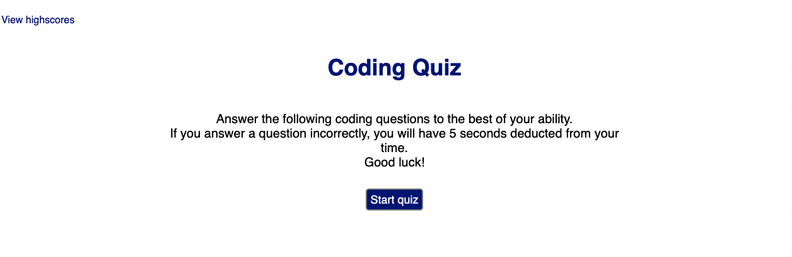
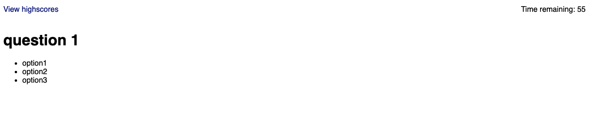
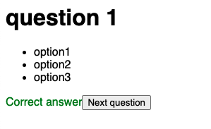
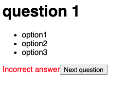
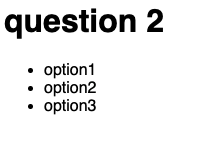

# Timed code quiz

https://caitlinparsons25.github.io/timed-code-quiz/

## Aims of the project
1. When the user clicks the "Start quiz" button, the quiz and the 60-second timer start
2. When the user chooses an answer, text will appear letting them know whether they chose the correct or incorrect answer
3. An incorrect answer deducts 5 seconds from the timer
4. When the user clicks the "Next question" button, the next question appears

### 1. When the user clicks the "Start quiz" button, the quiz and the 60-second timer start
When the user first navigates to the app, they are presented with an explanation of the quiz and a button they can click to start the quiz.

When they click on the "Start quiz" button, the quiz and timer both begin.

### 2. When the user chooses an answer, text will appear letting them know whether they chose the correct or incorrect answer
If the user chooses the correct answer, text will appear in green letting them know they have chosen the correct answer.

If the user chooses the incorrect answer, text will appear in red letting them know they have chosen an incorrect answer.

### 3. An incorrect answer deducts 5 seconds from the timer
When the user chooses an incorrect answer, 5 seconds are dedcuted from the timer; this is done using `time -=5` in the code for the function that checks the answer.

### 4. When the user clicks the "Next question" button, the next question appears
Upon clicking the "Next question" button, the data from question 1 is replaced by the data for question 2.

